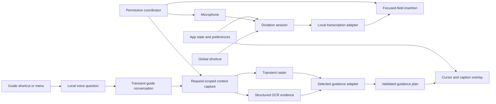

# Recommended Architecture

## Short Answer

- Build one native Swift/macOS application, not a platform or agent framework.
- Keep dictation and guidance as independent vertical features.
- Put macOS APIs and model vendors behind small protocols.
- Use explicit state machines for permissions, dictation, and companion
  visibility so UI and runtime state cannot silently diverge.
- Start with three local Swift targets plus the thin app target. Split further
  only when a boundary proves useful.

## System Picture



The dictation path does not import or call the guidance engine.

## Repository Shape

```text
GuideCompanion/
├── App/                       # lifecycle and dependency composition only
├── Packages/GuideCore/        # domain types, protocols, state machines
│   ├── Sources/GuideCore/
│   └── Tests/GuideCoreTests/
├── Packages/GuideMac/         # macOS and model-provider adapters
│   ├── Sources/GuideMac/
│   └── Tests/GuideMacTests/
├── Packages/GuideUI/          # onboarding, settings, overlay, status UI
│   ├── Sources/GuideUI/
│   └── Tests/GuideUITests/
├── GuideCompanionUITests/     # signed-app and accessibility journeys
├── scripts/                   # build, package, verify; no credentials
├── docs/                      # decisions, threats, provenance
└── evidence/                  # exact-artifact verification reports
```

This is intentionally three local packages, not dozens of micro-modules.

## Module Ownership

| Module | Owns | Must not own |
| --- | --- | --- |
| GuideCore | Sessions, events, preferences schema, protocols, failure types | AppKit, SwiftUI, provider SDKs |
| GuideMac | Audio, hotkeys, Accessibility, screen capture, Vision/OCR, local model adapters, persistence | Product policy or views |
| GuideUI | Menu, onboarding, settings, overlays, status and recovery actions | Direct model/vendor calls |
| App | Construction, lifecycle, activation policy, dependency wiring | Feature algorithms |

Dependencies point inward: `App -> GuideUI/GuideMac -> GuideCore`. GuideCore
imports neither GuideMac nor GuideUI.

## Core State Machines

### Permission flow

```text
unknown -> explained -> userRequested -> granted
                    \-> denied -> recoveryAvailable
                               \-> unavailable
```

Invariants:

- No permission prompt without a preceding user action and explanation.
- Declining does not cause repeated prompts.
- Restart-required grants preserve and resume the current onboarding step.
- Microphone and Accessibility are sufficient for dictation; Screen Recording
  is not a startup requirement.

### Dictation session

```text
idle -> preparing -> recording -> transcribing -> inserting -> succeeded -> idle
                    |              |              |
                    +-----------> cancelled <-----+
                    +-----------> failed(stage, recovery)
```

The session snapshots the focused application and editable target when
recording starts, then validates the target again before insertion.

### Companion visibility

```text
disabled
enabledBlocked(reason)
enabledVisible
enabledTemporarilyHidden(reason, returnPolicy)
```

Invariant: when the persisted preference is enabled and no documented blocker
exists, every temporary hide path must return to `enabledVisible`.

### Guidance conversation and request

```text
conversation idle -> listening -> transcribing -> userTurn -> capturing -> understanding -> planning
                  -> guideTurn -> readyForFollowUp
                  -> failed(stage, recovery) -> readyForFollowUp
                  -> reset -> conversation idle
```

The recent conversation is held in memory and supplied with each new request.
It is not written to transcript history or logs. Each turn captures fresh
context; prior screen pixels are neither retained nor replayed.

The engine streams provider-neutral `GuidanceStreamEvent` values. Text deltas
build the visible answer, complete sentence chunks may enter the local speech
queue, and spatial actions must pass independent validation before presentation.
Provider-specific request and SSE types remain in GuideMac.

The completed turn still resolves to a structured `GuidancePlan`, not arbitrary
overlay commands:

```text
GuidancePlan
  answer: String
  point: CGPoint?
  confidence: Float
```

Coordinates are accepted only when they reference the exact locked-window
screenshot, fall within its normalized bounds, convert inside its captured
window frame, and pass the confidence threshold. Low-confidence responses
provide prose without pointing.

## Important Protocol Seams

- `AudioCapturing`
- `SpeechTranscribing`
- `FocusedTextTargetReading`
- `TextInserting`
- `GlobalShortcutMonitoring`
- `PermissionChecking`
- `ScreenContextCapturing`
- `ScreenContextExtracting`
- `GuidanceGenerating`
- `TalkCredentialStoring`
- `OverlayPresenting`
- `ModelInstalling`

Each external dependency implements one of these seams. Product state refers to
capabilities and failures, never vendor names.

## Local Speech Strategy

Do not choose a permanent speech runtime from README claims. Phase 0 compares:

1. Apple on-device Speech as the zero-download fallback where genuinely local.
2. WhisperKit as an MIT-licensed, Swift-native Apple Silicon candidate.
3. FluidAudio/Parakeet, using OpenClicky's integration only as reference unless
   a narrowly reusable unit passes provenance and coupling review.

Measure cold start, first partial result, final-result latency, memory, model
size, English accuracy, punctuation, cancellation, offline behavior, and
failure recovery. Select through ADR 0002 after the probe.

## Text Insertion Strategy

Use a capability chain rather than one brittle technique:

1. Persist the completed transcript atomically before attempting delivery.
2. Use normal session-stream paste as the broad compatibility path.
3. Use Accessibility insertion or selected-value replacement only for targets
   whose resulting value can be observed and verified.
4. Preserve every clipboard item and representation; restore only while the
   pasteboard change count proves the app still owns its temporary contents.
5. Report a clear unsupported-target error when neither path is safe.

Posting paste events is not proof that insertion succeeded. Mark delivery
confirmed only when the destination can be read back; otherwise retain an
unconfirmed recovery item with Copy, Retry, and Delete. Never press Return,
submit forms, overwrite a newer clipboard change, or silently discard a
transcript.

## Screen Guidance Strategy

- Capture only after explicit activation.
- Voice is the primary guide input. The hotkey starts listening, a second press
  submits the spoken question, and Escape cancels.
- Keep the cursor companion as the primary response surface and speak answers
  with the local system voice. A normal, non-floating window is optional
  transcript inspection only.
- Include recent in-memory turns so follow-up questions retain meaning.
- Local guidance uses Vision OCR. When the user explicitly selects OpenAI Talk
  and accepts its disclosure, only the exact locked-window raster, question,
  and bounded recent Talk summary are sent once through the Responses API with
  `store: false`. OCR text and target metadata are not duplicated into the
  provider request.
- Use the system content-sharing picker where it improves user control.
- Treat Apple Foundation Models as one adapter, not a minimum-OS assumption.
- On systems without a capable local guidance model, dictation still works and
  guidance reports its exact limitation.
- Cloud failure never silently selects local guidance, and local failure never
  silently sends data to a provider.
- A saved OpenAI credential is not sufficient authorization. A content-free
  model-metadata preflight must succeed, and that verification expires after
  15 minutes. Unverified, expired, and rejected credentials block capture/send.

## Storage and Privacy

- UserDefaults: small preferences and completed onboarding steps.
- Application Support: downloaded model manifests, checksums, redacted logs,
  and the bounded local transcript recovery store.
- Keychain: stores the tester-supplied OpenAI key for the optional Talk path.
  It is never displayed, logged, persisted in defaults, or included in
  diagnostics. A future distributed product must use a server-issued token or
  backend rather than shipping a shared secret in the client.
- By default, persist only the newest Last Dictation: 10 minutes after
  confirmed delivery or 24 hours after unconfirmed/failed delivery. Persist it
  atomically before delivery so a crash cannot erase the user's words.
- Full transcript history is opt-in, bounded to 25 entries and 30 days.
- Audio history is a separate opt-in and is never enabled implicitly.
- Transcript and audio files use owner-only permissions and are excluded from
  backups. Screenshots are never stored.
- No account, telemetry SDK, analytics identifier, or localhost control bridge.
- Logs contain session IDs, durations, stages, and error categories—not content.

## Release Shape

- Direct-download native macOS app.
- Stable downstream bundle ID and Developer ID identity from the first signed
  interactive build to avoid TCC churn.
- Hardened Runtime, notarized and stapled DMG.
- The proven packaging/evidence workflow may be adapted, but upstream product
  identity, appcast, keys, assets, and destinations must not be copied.
- Mac App Store sandboxing and automatic updates are separate later decisions.

## Menu-Bar Presentation

Use the native SwiftUI `MenuBarExtra` menu style for status and primary actions.
Do not place a fixed-width dashboard or vertically unbounded card stack in the
menu-bar surface. Detailed setup, explanations, diagnostics, and manual tests
belong in the normal Settings window; transient conversation history belongs in
its normal non-floating transcript window.

## Rejected Initial Shapes

| Shape | Decision | Reason |
| --- | --- | --- |
| Fork OpenClicky wholesale | Reject | Broad coupled scope and inherited failure states |
| Reverse engineer HeyClicky implementation | Reject | Hidden internals and unnecessary clean-room risk |
| Local HTTP agent bridge | Defer | Adds attack surface without helping core journeys |
| One giant observable manager | Reject | Recreates the coupling already observed |
| Cloud-first assistant | Reject | Local remains default; only an explicit optional Talk adapter is allowed |
| Many tiny packages | Reject | More build and ownership overhead than this app needs |
