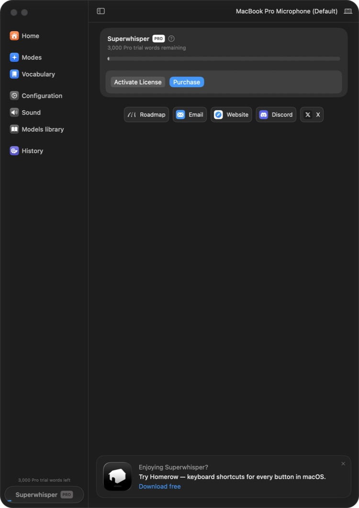
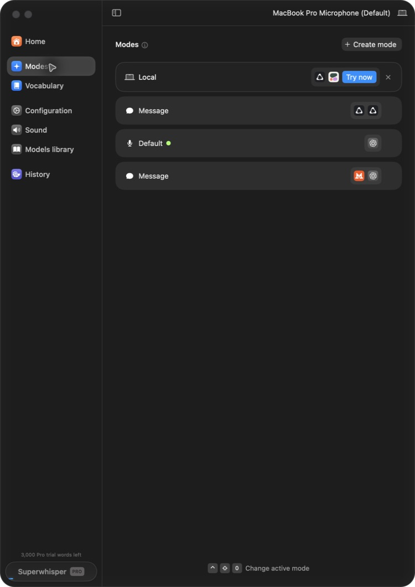
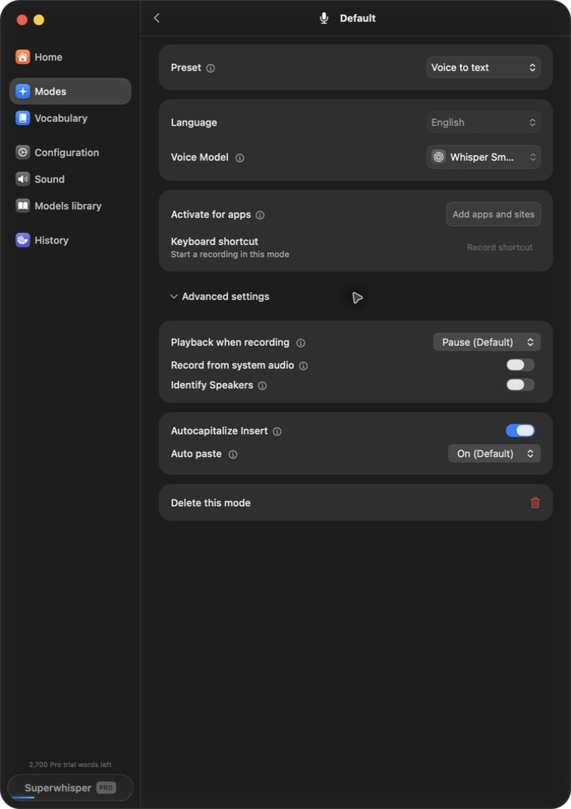
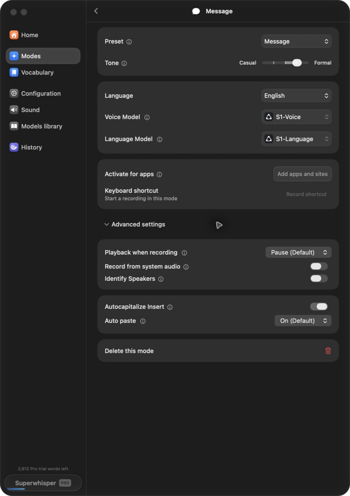
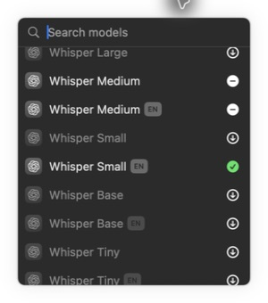
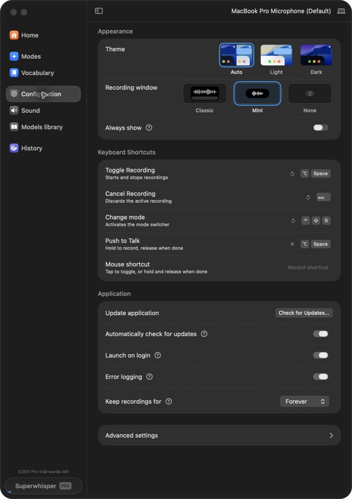
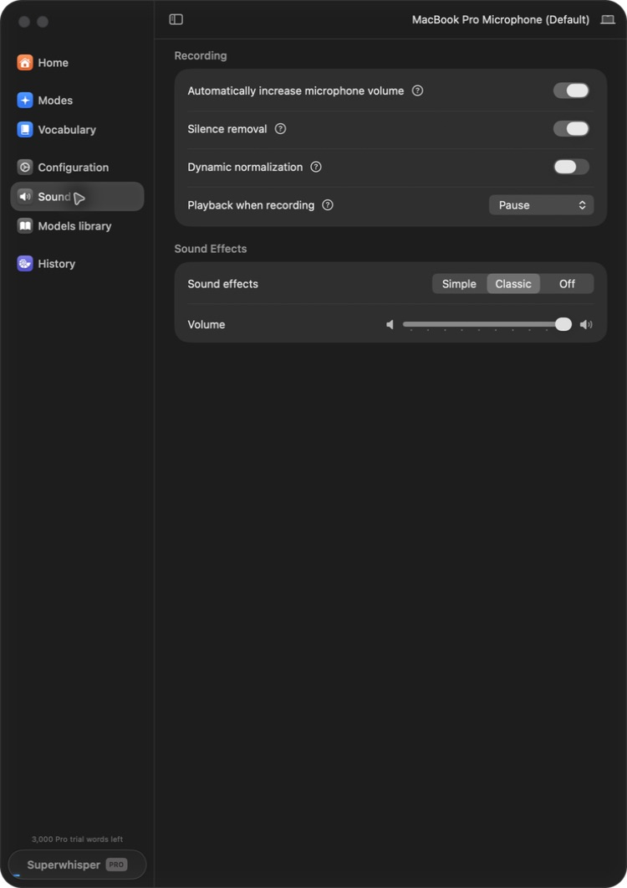
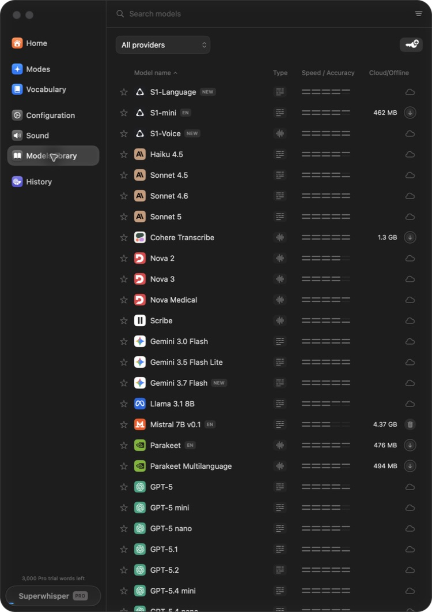
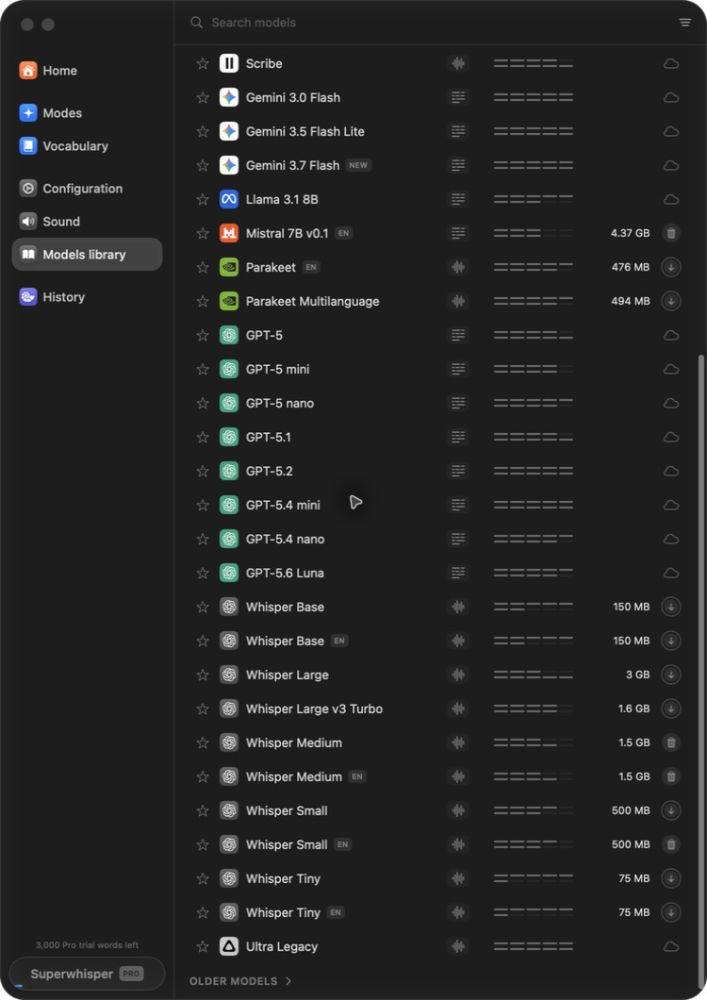

# Superwhisper Dictation reference inventory

- Date: 2026-09-04
- Scope: existing Dictation functionality for serpy Version 1
- Reference app: `/Applications/superwhisper.app`
- Bundle identifier: `com.superduper.superwhisper`
- Version/build: `2.18.3 (2.18.3)`
- Minimum macOS: 14.0
- Architectures: `x86_64`, `arm64`
- Executable SHA-256: `6e6c36b4d410f854889e025c5e97f1fe59632677f410896956fe6d238dfcaf2a`
- Signature: Developer ID Application, team `XDP69BYUP9`
- Target product: serpy, preserving its existing technical identity

## Evidence boundary

The installed app and official documentation are behavioral/product oracles.
They do not expose Superwhisper's private implementation. Agents may observe
normal UI and public behavior, but may not decompile the app, copy private data,
or infer hidden implementation from screenshots.

Implementation should remain source-first rather than agent-invented. Use a
licensed open-source Dictation donor where source is required, document exact
imports under `docs/imports/`, and write only the serpy-specific integration
needed to preserve its local/privacy/recovery requirements.

Primary external references:

- [Saved product reference](../reference/superwhisper-product.md)
- [Official introduction](https://superwhisper.com/docs/get-started/introduction)
- [Product landing page](https://superwhisper.com/)
- [Yap](https://github.com/FrigadeHQ/yap), primary MIT donor for the
  protocol-driven macOS 26 `SpeechAnalyzer`/`SpeechTranscriber` pipeline
- [OpenSuperWhisper](https://github.com/Starmel/OpenSuperWhisper), MIT candidate
  donor for native recording, transcription, shortcut, microphone, and
  clipboard behavior
- [open-wispr](https://github.com/human37/open-wispr), MIT secondary candidate
  for test-backed lifecycle and insertion behavior

## Captured settings surfaces

All committed images are direct captures of the installed reference window at
750×1060. They document information architecture and controls, not a Version 1
requirement to reproduce the entire Settings design.

### Home

Observed: persistent left navigation, current microphone in the window header,
license/trial state, product/community actions, and a bottom promotional card.
Licensing, purchasing, community links, and promotions are outside Version 1.

### Modes

Observed: named modes, an active/default indicator, provider/model badges,
create-mode action, mode testing, and a global change-mode shortcut. Version 1
requires the existing plain Dictation path; custom mode creation and cloud text
processing are later features.

#### Default voice-to-text mode

Observed: the Default mode drills into a Voice to text preset, language, voice
model, optional app/site activation, mode-specific recording shortcut, and
advanced controls for playback during recording, system-audio recording,
speaker identification, automatic capitalization, auto paste, and deletion.

Version 1 functional reference: plain voice-to-text, the existing local voice
model, and automatic insertion. App-specific activation, system-audio capture,
speaker identification, and Settings parity are later work.

#### Message processing mode

Observed: the Message preset adds a casual-to-formal tone control and a separate
language model to the same voice-model, activation, shortcut, playback,
system-audio, speaker, capitalization, auto-paste, and deletion controls.

This confirms that Superwhisper separates transcription from optional text
processing. Version 1 serpy Dictation stays local and does not depend on a
language model; Guide remains a separate capability.

#### Voice-model picker

Observed: a searchable model picker distinguishes cloud entries, downloadable
local entries, installed entries, language variants, and the current selection.
The captured lower section includes Whisper Large, Medium, Small, Base, and Tiny
variants.

The picker is reference evidence for a replaceable voice-model boundary. Adding
model selection/download UI is not part of Version 1 stabilization.

### Vocabulary

The supplied Vocabulary capture is intentionally not committed because it
contains an email address and user-specific vocabulary. Its nonprivate structure
is recorded here:

- left-navigation destination;
- one field for a new word or replacement;
- separate Add word and Replace with actions with keyboard equivalents;
- CSV import action; and
- a list of configured words/replacements.

Vocabulary behavior is a later feature, not a Version 1 stabilization gate.

### Configuration

Observed:

- Auto, Light, and Dark appearance;
- Classic, Mini, and None recording-window choices;
- Always show toggle;
- Toggle Recording shortcut with start/stop semantics;
- Escape cancellation that discards the active recording;
- change-mode shortcut;
- Push to Talk using hold/release semantics;
- optional mouse shortcut;
- update checking, launch on login, error logging, recording retention, and an
  Advanced settings destination.

Version 1 functional reference: toggle/hold activation, immediate recording
feedback, Escape cancellation, and predictable cleanup. Settings redesign,
mouse activation, update UI, launch-on-login, and additional options are later.

### Sound

Observed: current microphone, automatic microphone-volume adjustment, silence
removal, dynamic normalization, playback behavior while recording, selectable
recording sound effects, and volume control.

Version 1 functional reference: microphone readiness, complete-word capture,
and audible start/stop feedback if already present. Adding new sound controls or
signal processing is later work.

### Models library

Observed: searchable/filterable provider list, separate voice/text model types,
relative speed/accuracy indicators, cloud/offline status, favorite state,
download/delete actions, and local sizes including Parakeet and Whisper models.

Version 1 uses the existing serpy local engine. Model-library parity, additional
providers, downloads, ranking, and cloud processing are later work.

### History

The supplied History capture is intentionally not committed because it contains
private dictated text. Its nonprivate structure is recorded here:

- history search;
- dated recording groups;
- transcript preview;
- audio playback with waveform and duration;
- Original and Segmented views;
- Copy transcript;
- reprocess actions;
- recording information; and
- deletion.

Version 1 stabilizes serpy's existing Last Dictation recovery only. Full
Superwhisper-style History parity and changed retention defaults are later.

## Version 1 behavior to reproduce

This is the smallest Superwhisper-style acceptance unit for existing serpy
Dictation:

1. Keep TextEdit or Chrome frontmost.
2. Invoke the existing Dictation shortcut using toggle or the already-supported
   hold/release behavior.
3. Show immediate compact recording state without activating serpy.
4. Capture the complete utterance, including the final word at shortcut release.
5. Transcribe using the existing local engine.
6. Insert the exact result at the previously focused destination without
   submitting it.
7. Preserve every representation of the prior clipboard unless the user makes a
   newer clipboard change.
8. Escape cancels and discards the active attempt; late callbacks cannot insert.
9. Failed or unconfirmed delivery leaves the existing Last Dictation recovery
   available.
10. Quit/relaunch leaves one app instance and no repeated permission prompt.

## Implementation-quality requirements

Settings parity is not the quality target. The important Superwhisper behavior
is that a long active recording remains recoverable and complete even when
transcription or processing fails.

The owner's current serpy report is: after speaking for long enough, the final
result sometimes omits information or is not saved completely. This is a
Version 1 blocker.

Superwhisper's public changelog and troubleshooting material record the
reliability mechanisms relevant to that symptom:

- version 1.17 added a delay before stopping recording to avoid losing the last
  word;
- version 1.33 saves the WAV every 10 seconds to avoid losing long recordings;
- later changes explicitly added long-recording support for Whisper/Groq;
- troubleshooting says active dictations are saved every few seconds; and
- History retains the original recording so it can be reprocessed after a poor
  or failed result.

References:
[changelog](https://superwhisper.com/changelog),
[troubleshooting](https://superwhisper.com/docs/common-issues/troubleshooting),
[History](https://superwhisper.com/docs/get-started/interface-history), and
[reprocessing](https://superwhisper.com/docs/get-started/transcribe-history).

Apple documents that `SFSpeechRecognizer` tasks should be designed around a
one-minute audio limit. Current serpy creates one
`SFSpeechAudioBufferRecognitionRequest` for the entire recording, stores only
the latest formatted result, and has no task rollover. When audio-history is
off, it also keeps no temporary recording from which a missing tail can be
reconstructed. Recording-file writes use `try?`, so a write failure is silent.
These are source-evidenced risks; the exact owner symptom still requires the
red feedback loop below.

Reference:
[Apple `SFSpeechRecognizer`](https://developer.apple.com/documentation/speech/sfspeechrecognizer).

### Required red feedback loop

Before changing the engine, add an agent-runnable long-dictation fixture with
known sentinel phrases near the beginning, around the one-minute boundary, and
at the end. The loop must exercise the production transcription path or the
smallest extracted input seam and assert that every sentinel appears exactly
once and in order.

The final regression must cover:

1. at least a multi-minute recording;
2. periodic recoverable audio checkpoints no more than 10 seconds apart, or an
   independently proven equivalent durability mechanism;
3. a forced recognition-task limit/error after partial results;
4. continuation or file-based final transcription without losing the committed
   prefix;
5. stop-tail preservation;
6. cancellation without late insertion;
7. forced checkpoint/write failure reported explicitly rather than ignored;
8. sudden termination followed by recovery of all checkpointed audio; and
9. final transcript persistence before delivery.

Live partial text is feedback, not the source of truth. The complete temporary
audio remains available until a final transcript is durably preserved or the
user cancels. When history/audio retention is disabled, this recording remains
temporary and is deleted after the bounded recovery contract permits it.

### Active-session formatting observation

The owner reports that installed Superwhisper can apply a Shift/Return action
while a long recording is still active and continue the session without losing
earlier speech. Official documentation separately describes Hold Shift to
Auto-Send when finishing a Dictation; that is not necessarily the same action.

Treat the owner's active-session behavior as an observation requiring one
focused recording of the exact keystrokes and state transitions before it is
implemented. The invariant is already clear: any processing/formatting command
must operate on a derived transcript snapshot and must not stop, truncate,
reorder, duplicate, or replace the durable raw recording. Because serpy does not
currently expose this control, adding it is not a Version 1 stabilization blocker
unless the owner explicitly promotes it into the release scope.

## Source-first implementation rule

Before creating an original Dictation abstraction, the implementation agent
must map each failing behavior to existing serpy code and to a licensed donor
unit. Yap's pinned tested `RecordingCoordinator` is the approved starting
orchestration seam; it is donor code, not an agent-invented design.

Adopt when a donor already supplies the required behavior. Adapt only for serpy
module boundaries, local-provider choice, privacy, recovery, and stable app
identity. Write a new unit only when the import map demonstrates that neither
donor provides the required behavior.

Do not invent a parallel `DictationSessionCoordinator`. Copy/adapt Yap's
`RecordingCoordinator`, `DictationSession`, `AudioBufferRelay`,
`TranscriptionService`, `AudioCaptureService`, and corresponding coordinator
tests, then add only the durability/recovery behavior identified above.

## Privacy and capture notes

- The user supplied all seven Settings screen descriptions.
- Six privacy-safe screens were recaptured and committed.
- Vocabulary and History images remain uncommitted because they contain an email
  address, user vocabulary, and dictated content.
- No recording was started and no dictation, microphone input, clipboard change,
  model download, account action, or deletion was performed during this pass.
